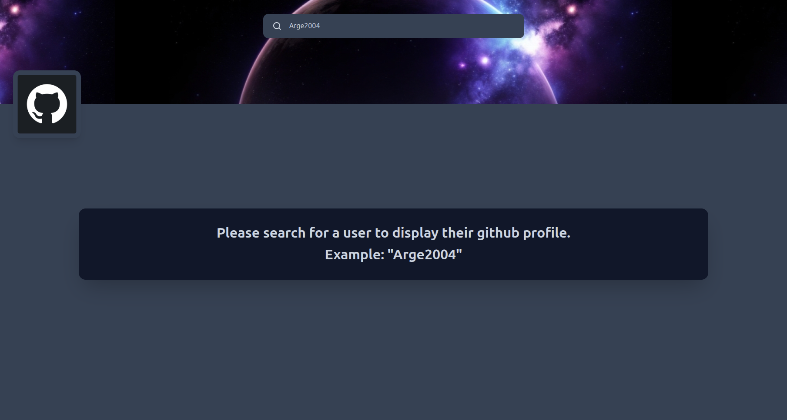
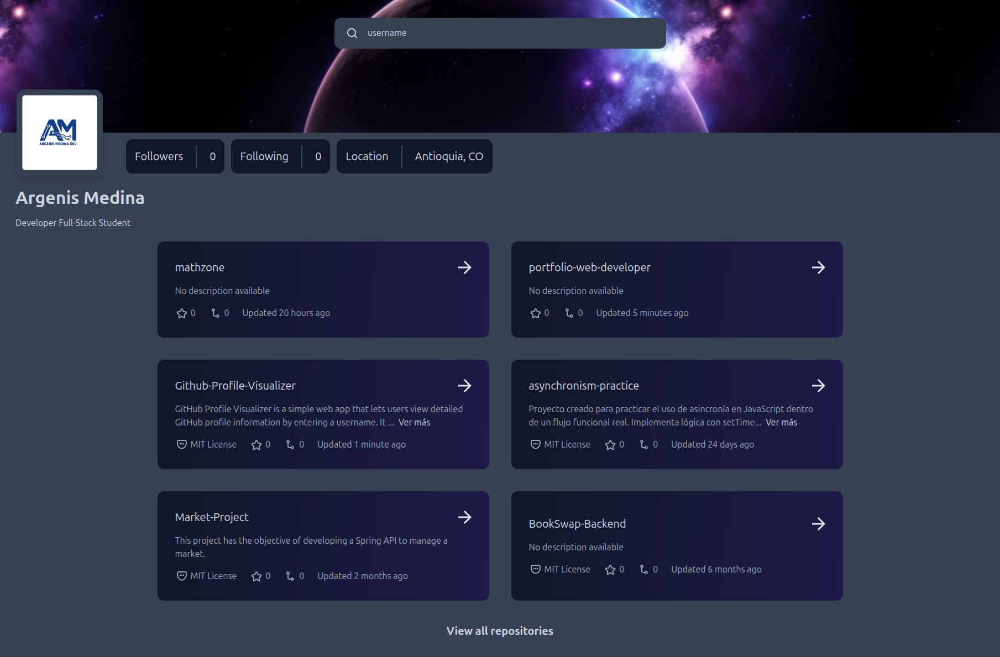

# GitHub Profile Visualizer

[](https://reactjs.org/)
[](https://www.typescriptlang.org/)
[](https://tailwindcss.com)
[](LICENSE)

Una aplicación web simple que permite explorar información detallada de perfiles de GitHub ingresando un nombre de usuario.  

Muestra la bio, avatar, seguidores y repositorios en una interfaz limpia, rápida y responsive.

---

## 🚀 Demo  
[Ver demo en vivo](https://github-profile-visualizer-eosin.vercel.app/)  

---

## 📸 Capturas de pantalla

  
_Búsqueda rápida por nombre de usuario_

  
_Visualización de datos del usuario y estadísticas_

---

## 🛠 Tecnologías utilizadas  
- **React**  
- **TypeScript**  
- **Tailwind CSS**  

---

## ⚙️ Características principales  
- Búsqueda rápida por usuario GitHub  
- Perfil con bio, avatar, seguidores y repositorios  
- Diseño responsive  

---

## 📦 Instalación y ejecución local  
```bash
git clone https://github.com/tuusuario/github-profile-visualizer.git
cd github-profile-visualizer
npm install
npm run dev

📄 Licencia
MIT License — ver LICENSE

